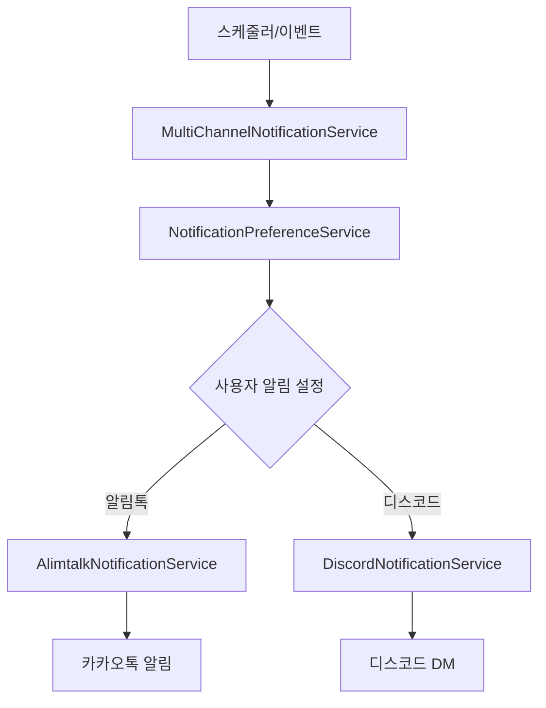

# CheckUS 통합 알림 시스템

## 개요

CheckUS 서버의 통합 알림 시스템은 학생들의 학습 활동을 체계적으로 모니터링하고, 선생님과 학부모 간의 효율적인 소통을 지원합니다. 알림톡과 디스코드를 통해 멀티채널 알림을 제공합니다.

## 주요 기능

### 📅 스케줄링 기반 알림
- **공부 시작 10분 전 알림**: 학습 준비를 위한 사전 알림
- **공부 시작 시간 알림**: 정시 학습 시작 독려
- **오늘의 할일 알림**: 매일 아침 8시 학습 계획 전달
- **전날 미완료 할일 알림**: 아침(8:30)과 저녁(20:00) 두 차례 알림
- **미접속 알림**: 학습 시작 15분 후 미접속 시 알림

### 🎯 실시간 이벤트 기반 알림
- **스터디룸 입장 알림**: 학습 시작 확인
- **조기퇴장 알림**: 예정 시간보다 일찍 종료 시 알림
- **늦은입장 알림**: 예정 시간보다 늦게 시작 시 알림

### 📱 멀티채널 지원
- **알림톡**: 카카오톡을 통한 공식 알림
- **디스코드**: 실시간 메신저를 통한 즉시 알림
- **사용자별 채널 설정**: 개인 선호에 따른 알림 채널 선택

## 시스템 구조

### 핵심 컴포넌트

```
📦 notification
├── 📂 scheduler
│   ├── UnifiedNotificationScheduler     # 통합 스케줄러 (NEW)
│   └── AlimtalkScheduler               # 기존 알림톡 스케줄러 (DEPRECATED)
├── 📂 service
│   ├── MultiChannelNotificationService  # 멀티채널 알림 서비스
│   ├── AlimtalkNotificationService     # 알림톡 서비스
│   ├── DiscordNotificationService      # 디스코드 서비스
│   └── NotificationPreferenceService   # 사용자 알림 설정 서비스
├── 📂 event
│   └── NotificationEventListener       # 실시간 이벤트 처리
├── 📂 domain
│   └── AlimtalkTemplate               # 알림 템플릿 관리
└── 📂 config
    └── SchedulerConfig                # 스케줄러 설정
```

### 알림 흐름



## 알림 템플릿

### 기본 알림
- `STUDY_REMINDER_10MIN`: 공부 시작 10분 전 (D0001)
- `STUDY_START`: 공부 시작 시간 (D0002)
- `NO_SHOW`: 미접속 알림 (D0003)
- `TODAY_TASKS`: 오늘의 할일 (S0001)
- `YESTERDAY_INCOMPLETE_EVENING`: 전날 미완료 할일 저녁 (S0002)

### 실시간 이벤트 알림
- `STUDY_ROOM_ENTER`: 스터디룸 입장 완료
- `EARLY_LEAVE`: 조기퇴장 알림 (E0001)
- `LATE_ARRIVAL`: 늦은입장 알림 (L0001)

## 설정

### application.yml 설정

```yaml
# 알림 시스템 설정
notification:
  # 통합 스케줄러 활성화 (기본값: true)
  scheduler:
    enabled: ${NOTIFICATION_SCHEDULER_ENABLED:true}
  
  # 기존 알림톡 전용 스케줄러 비활성화 (기본값: false)
  alimtalk-scheduler:
    enabled: ${ALIMTALK_SCHEDULER_ENABLED:false}
    
# 디스코드 봇 설정
discord:
  bot:
    enabled: ${DISCORD_BOT_ENABLED:true}
    token: ${DISCORD_BOT_TOKEN}
```

### 환경변수

| 변수명 | 설명 | 기본값 |
|--------|------|--------|
| `NOTIFICATION_SCHEDULER_ENABLED` | 통합 스케줄러 활성화 | `true` |
| `ALIMTALK_SCHEDULER_ENABLED` | 기존 알림톡 스케줄러 활성화 | `false` |
| `DISCORD_BOT_ENABLED` | 디스코드 봇 활성화 | `true` |
| `DISCORD_BOT_TOKEN` | 디스코드 봇 토큰 | 필수 |

## 스케줄링

### Cron 표현식

| 기능 | 주기 | Cron 표현식 |
|------|------|-------------|
| 10분 전 알림 | 매분 | `0 * * * * *` |
| 시작 시간 알림 | 매분 | `0 * * * * *` |
| 오늘의 할일 | 매일 08:00 | `0 0 8 * * *` |
| 미완료 할일 (아침) | 매일 08:30 | `0 30 8 * * *` |
| 미완료 할일 (저녁) | 매일 20:00 | `0 0 20 * * *` |
| 미접속 체크 | 5분마다 | `0 */5 * * * *` |

## API 사용법

### 실시간 알림 전송

```java
// 특정 채널로 알림 전송
@Autowired
private MultiChannelNotificationService notificationService;

// 사용자 설정에 따른 멀티채널 알림
CompletableFuture<Boolean> result = notificationService.sendNotification(
    userId, 
    templateId, 
    variables
);

// 특정 채널로만 알림
CompletableFuture<Boolean> result = notificationService.sendNotificationToChannel(
    recipient,
    templateId,
    variables,
    NotificationService.NotificationChannel.DISCORD
);
```

### 이벤트 발행

```java
// 스터디룸 입장 이벤트
StudyRoomEnterEvent event = StudyRoomEnterEvent.builder()
    .studentId(studentId)
    .studentName(studentName)
    .enterTime(LocalDateTime.now())
    .build();

applicationEventPublisher.publishEvent(event);

// 출석 이벤트 (조기퇴장/늦은입장)
StudyAttendanceEvent event = new StudyAttendanceEvent(
    this,
    StudyAttendanceEvent.EventType.EARLY_LEAVE,
    student,
    studyTime,
    remainingMinutes
);

applicationEventPublisher.publishEvent(event);
```

## 테스트

### 단위 테스트

```bash
# 스케줄러 테스트
./gradlew test --tests "*UnifiedNotificationSchedulerTest*"

# 이벤트 리스너 테스트
./gradlew test --tests "*NotificationEventListenerTest*"

# 멀티채널 서비스 테스트
./gradlew test --tests "*MultiChannelNotificationServiceTest*"
```

### 통합 테스트

```bash
# 전체 알림 시스템 테스트
./gradlew test --tests "*notification*"
```

## 마이그레이션 가이드

### 기존 시스템에서 전환

1. **설정 변경**
   ```yaml
   notification:
     alimtalk-scheduler:
       enabled: false  # 기존 스케줄러 비활성화
     scheduler:
       enabled: true   # 새 통합 스케줄러 활성화
   ```

2. **점진적 전환**
   - 기존 알림톡 스케줄러와 병행 운영 가능
   - 디스코드 알림 추가로 알림 신뢰성 향상
   - 사용자별 채널 설정으로 맞춤형 알림 제공

3. **모니터링**
   - 로그를 통한 알림 전송 상태 확인
   - 실패한 알림에 대한 로깅 및 재시도 로직

## 로깅

### 로그 레벨

- `DEBUG`: 개별 알림 전송 성공/실패
- `INFO`: 스케줄러 실행 및 대량 알림 처리
- `WARN`: 알림 전송 실패 및 설정 문제
- `ERROR`: 시스템 오류 및 예외 상황

### 주요 로그 포인트

```
# 스케줄러 실행
[INFO] 공부 시작 10분 전 알림 발송 완료 - 15건

# 개별 알림 성공
[DEBUG] 10분 전 알림 전송 성공 - 학생 ID: 123

# 알림 실패
[WARN] 학부모 알림 전송 실패 - 학부모 ID: 456, 템플릿: STUDY_START

# 이벤트 처리
[INFO] 출석 이벤트 수신 - 타입: EARLY_LEAVE, 학생: 홍길동, 시간: 30분
```

## 성능 최적화

### 비동기 처리
- 모든 알림 전송은 `CompletableFuture`로 비동기 처리
- 이벤트 리스너는 `@Async`로 비동기 실행
- 스케줄러는 전용 스레드풀에서 실행

### 스레드풀 설정
```java
@Configuration
public class SchedulerConfig implements SchedulingConfigurer {
    @Override
    public void configureTasks(ScheduledTaskRegistrar taskRegistrar) {
        ThreadPoolTaskScheduler taskScheduler = new ThreadPoolTaskScheduler();
        taskScheduler.setPoolSize(5);
        taskScheduler.setThreadNamePrefix("notification-scheduler-");
        taskScheduler.initialize();
        
        taskRegistrar.setTaskScheduler(taskScheduler);
    }
}
```

## 문제해결

### 자주 발생하는 문제

1. **디스코드 봇 토큰 오류**
   ```
   해결: DISCORD_BOT_TOKEN 환경변수 확인
   ```

2. **알림톡 API 인증 실패**
   ```
   해결: BIZGO_CLIENT_ID, BIZGO_CLIENT_PASSWORD 확인
   ```

3. **스케줄러 중복 실행**
   ```
   해결: alimtalk-scheduler.enabled=false 설정 확인
   ```

4. **알림 전송 실패**
   ```
   해결: 사용자 전화번호/디스코드 ID 유효성 확인
   ```

## 향후 계획

### 단기 계획
- [ ] 이메일 알림 채널 추가
- [ ] SMS 알림 채널 추가
- [ ] 알림 전송 통계 대시보드
- [ ] 실패한 알림 재시도 로직

### 장기 계획
- [ ] AI 기반 알림 최적화
- [ ] 웹푸시 알림 지원
- [ ] 실시간 알림 설정 웹 인터페이스
- [ ] 알림 성과 분석 및 리포팅

---

**변경 사항**

| 일자 | 버전 | 변경 내용 | 커밋 메시지 |
|------|------|-----------|-------------|
| 2024-XX-XX | 1.0.0 | 통합 알림 시스템 구축 | Create unified notification scheduler |
| | | 조기퇴장/늦은입장 알림 추가 | Add early leave and late arrival notifications |
| | | 멀티채널 알림 지원 | Implement multi-channel notification support |
| | | 이벤트 기반 실시간 알림 | Add real-time event-based notifications |
